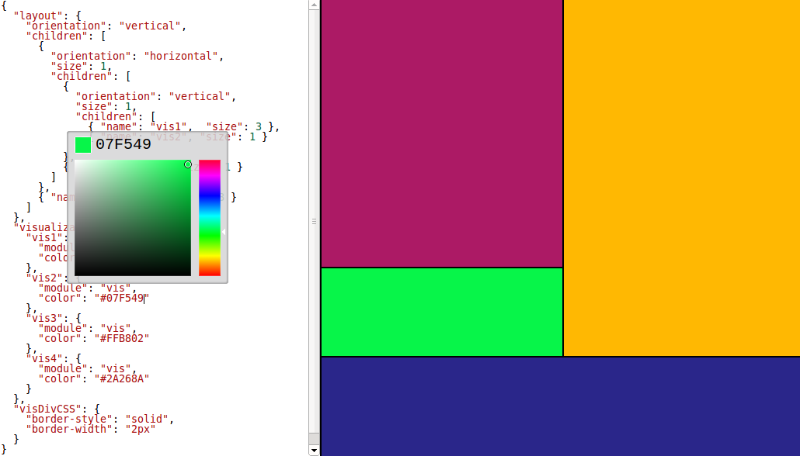

dashboardScaffold
=================

Plumbing for creating dashboards with D3.js. Includes an interactive configuration editor.

[Try it out!](http://curran.github.io/dashboardScaffold/index.html)



# Usage

## Installation
Use [Bower](https://github.com/bower/bower) to install:

`bower install dashboardScaffold`

## Require.js Configuration

Configure the package and its dependencies  with [Require.js](http://requirejs.org/docs/api.html#packages).

Dependencies:

 * [D3](d3js.org)
 * [Underscore](http://underscorejs.org/)
 * [CodeMirror](http://codemirror.net/)
 * [Inlet](https://github.com/enjalot/Inlet)

The following snippet should go in a `requireConfig.js` script loaded into your page right before loading `require.js` (see [index.html](blob/gh-pages/index.html) as an example):

```javascript
var require = {
  packages: [
    {
      name: 'dashboardScaffold',
      location: '../bower_components/dashboardScaffold/js/dashboardScaffold/',
      main: 'dashboardScaffold'
    }
  ],
  paths: {
    underscore: '//cdnjs.cloudflare.com/ajax/libs/underscore.js/1.4.4/underscore-min',
    backbone: '//cdnjs.cloudflare.com/ajax/libs/backbone.js/1.0.0/backbone-min',
    d3: '//cdnjs.cloudflare.com/ajax/libs/d3/3.1.6/d3.min',
    // Had to reverse codeMirror and codeMirrorJS in order to get file loading order right
    codeMirrorJS: '//cdnjs.cloudflare.com/ajax/libs/codemirror/3.12.0/codemirror.min',
    codeMirror: '//cdnjs.cloudflare.com/ajax/libs/codemirror/2.36.0/javascript',
    inlet: 'lib/inlet.min'
  },
  shim: {
    underscore: { exports: '_' },
    backbone:{
      deps: ['underscore'],
      exports: 'Backbone'
    },
    d3: { exports: 'd3' },
    codeMirror: {
      deps: ['codeMirrorJS'],
      exports: 'CodeMirror'
    },
    codeMirrorJS: {
      exports: 'CodeMirror'
    },
    inlet: { exports: 'Inlet' }
  }
```

## API

To wire up a `textArea` to be a configuration editor for a dashboard `div`, use the following call:

```javascript
dashboardScaffold.init('editor', 'dashboard');
```

Here, "editor" and "dashboard" are the ids of the DOM elements to be used.
